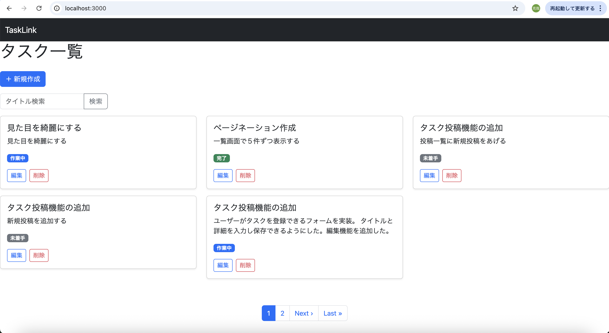
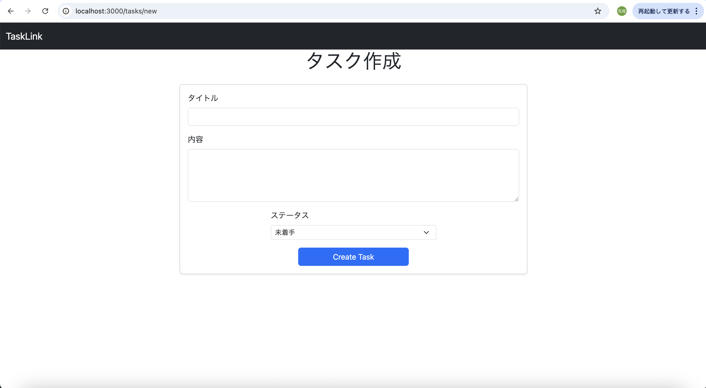
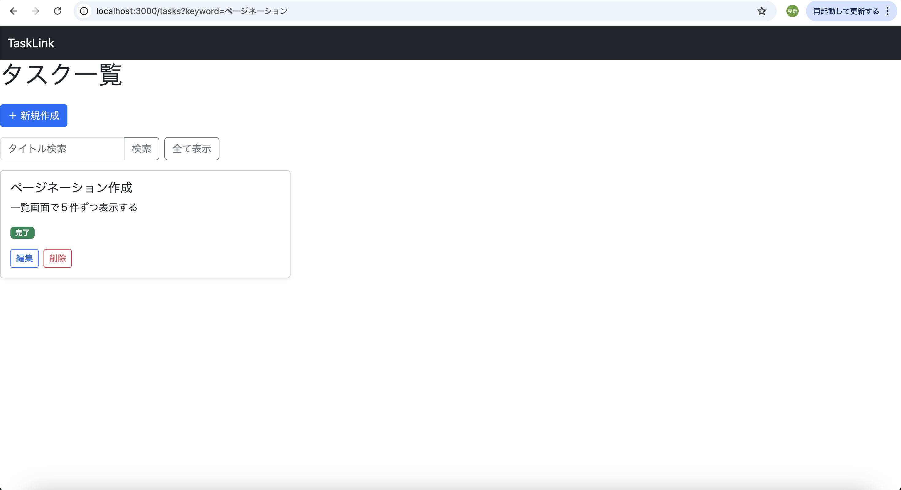

# README

# TaskLink（タスク管理アプリ）

## 📌 概要
タスクの作成・編集・削除・検索ができるシンプルなタスク管理アプリです。

## 🛠 使用技術
- Ruby on Rails 8
- PostgreSQL
- Bootstrap

## ✨ 機能一覧
- ユーザー登録 / ログイン（Devise）
- タスク投稿機能（CRUD）
- ステータス管理（未着手 / 作業中 / 完了）
- タイトル検索機能
- タスク一覧表示（カードUI）

## 💡 工夫した点
- enumを使ったステータス管理
- N+1問題を防ぐために includes を使用
- Bootstrapで見た目を改善
- 検索後にリセットできるUIを実装
- フォームをpartial化し、new/editで共通化して保守性を向上
- ページネーション（Kaminari）を導入し、大量データでも見やすくした
- 検索結果0件時のメッセージ表示など、UXを意識して実装しました

## 🚀 今後の課題
- チーム機能の強化
- UIのさらなる改善

## 📷 画面イメージ

### タスク一覧

### 新規作成

### 検索結果

