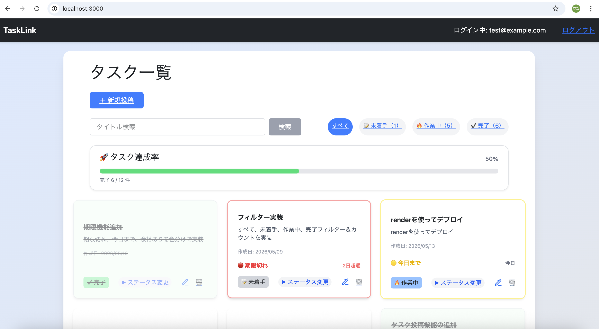
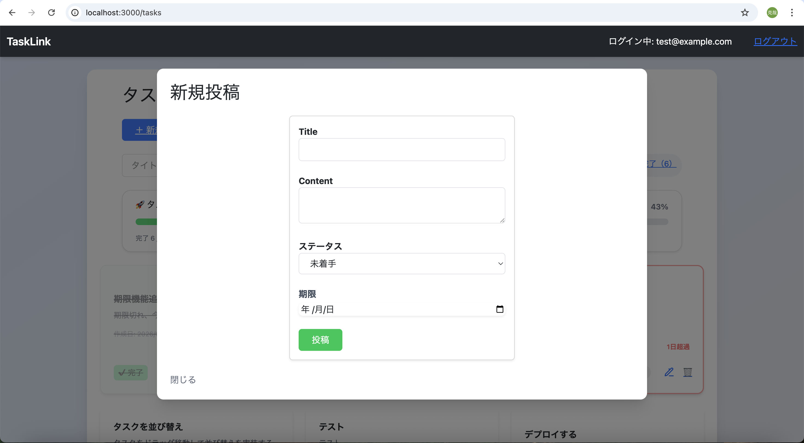
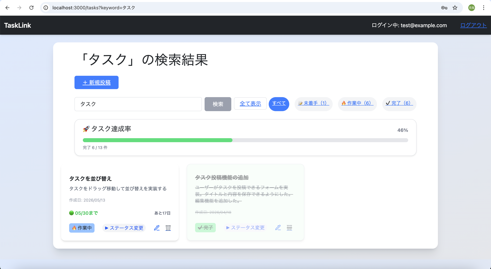
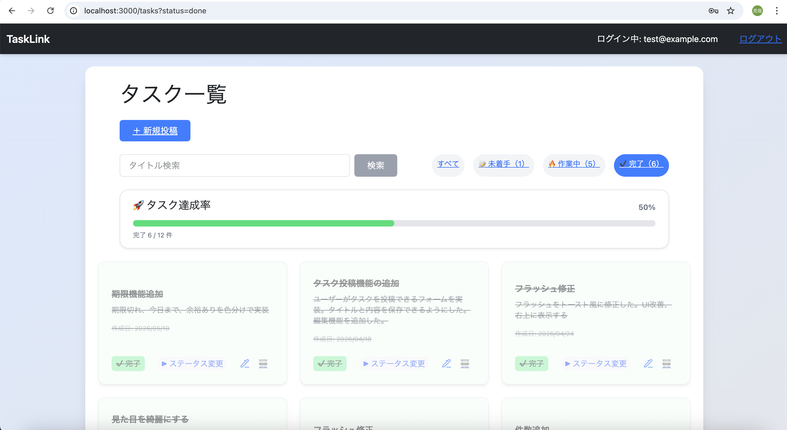
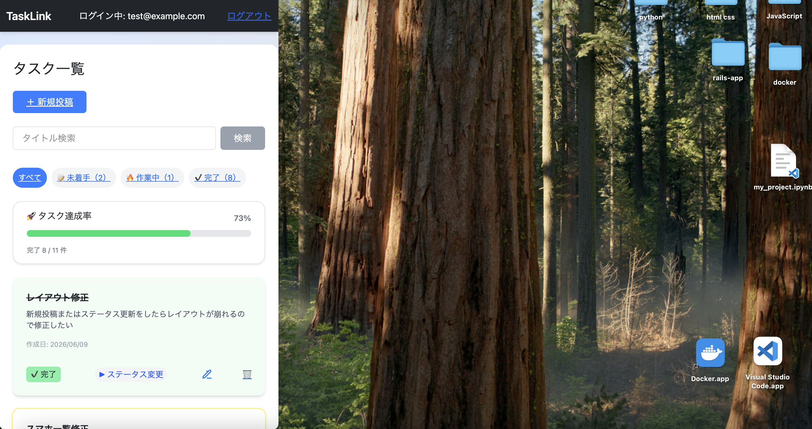

# TaskLink

📌 TaskLink

Rails + Turbo Streamで構築した、チーム向けタスク管理アプリです。
SPAを使わずにリアルタイムUI更新を実現し、実務レベルの開発・運用（CI/CD・AWS・監視）まで一貫して構築しています。

---

🚀 Demo / Links
* 🌐 Production（AWS）
https://tasklink-app.com
* 🧪 Demo（Render）
https://tasklink-1iv9.onrender.com
* 💻 GitHub
https://github.com/katsu-ya/tasklink

---

🧠 Why I Built This

従来のToDoアプリの課題：

* ページ更新が多くUXが悪い
* チーム利用を想定していない
* 進捗が直感的に分からない

👉 これらを解決するために開発

---

⚙️ Tech Stack
Category	Tech
Backend	Ruby 3.3 / Rails 8
Frontend	Turbo / Stimulus / Tailwind CSS
DB	PostgreSQL
Auth	Devise
Authorization	Pundit
Test	RSpec
CI/CD	GitHub Actions
Infra	AWS EC2 / Nginx / Puma / systemd
Dev	Docker / Docker Compose

---

📌 Features

📋 Task Management
* タスク作成 / 編集 / 削除
* ステータス管理（Todo / Doing / Done）
* 期限管理
* 達成率表示
  
🔍 Search / Filter
* キーワード検索
* ステータスフィルタ
* 件数リアルタイム更新

💬 Collaboration
* コメント機能（※予定 or 実装状況に合わせて調整）
* いいね機能

⚡ Real-time UX 
* Turbo Streamによる非同期更新
* Turbo FrameモーダルUI
* SortableJSによる並び替え

---

## 📷 画面イメージ

### タスク一覧画面

### タスク作成モーダル

### 検索結果画面（キーワード）

### 検索結果画面（完了タスク）

### スマホ表示

---

🧩 Architecture / Design Highlights
⚡ Turbo StreamでSPA不要のUX

タスク操作時に以下を即時更新：

* タスク一覧
* 進捗バー
* フィルター件数

👉 ページリロードなしで状態同期

🔐 Authorization (Pundit)
* policy_scopeで取得制御
* チーム単位でアクセス制御
* URL直打ち対策
🏢 Team-based Design

* ユーザーはチーム単位で管理され、
* タスクもチーム単位で共有される設計

🏗 Infrastructure
AWS Architecture
Route53
  ↓
ALB (HTTPS / ACM)
  ↓
EC2 (Nginx)
  ↓
Puma
  ↓
Rails
  ↓
PostgreSQL
📊 Monitoring / Observability
* CloudWatch Metrics
* CloudWatch Logs
* CloudWatch Alarm
* SNS通知

監視対象：

* CPU / Memory / Disk
* Puma死活監視
* Rails 500エラー
📦 Deployment
* GitHub ActionsでCI/CD
* main pushで自動デプロイ

CI:

* RSpec
* RuboCop
* bundler-audit

CD:

* migrate
* assets precompile
* Puma restart
🧪 Testing
* RSpec（Model / Request / Policy）
* 認証・認可テストあり
* カバレッジ：約75%
* bundle exec rspec
🧱 Development Setup
* docker compose build
* docker compose up

DB:

* docker compose run web rails db:create db:migrate
🧠 Challenges & Solutions
チーム機能導入時の問題

本番環境で team_id が存在しないデータが発生

対応
* Rails consoleで調査
* マイグレーション修正
* データ移行

👉 DB変更の影響範囲を学習

インフラ障害対応

ディスク容量不足が発生

対応
* CloudWatchで検知
* EBS拡張（8GB → 20GB）
* growpart / resize2fs実行

👉 監視・運用の重要性を理解

🗺 Roadmap
* High Priority
* コメント機能強化
* 通知機能
* Medium
* カレンダー表示
* 優先順位機能
* Low
* ダークモード
👤 Author
新城 克哉
* GitHub: https://github.com/katsu-ya
* Qiita: https://qiita.com/katsu-ya

---

