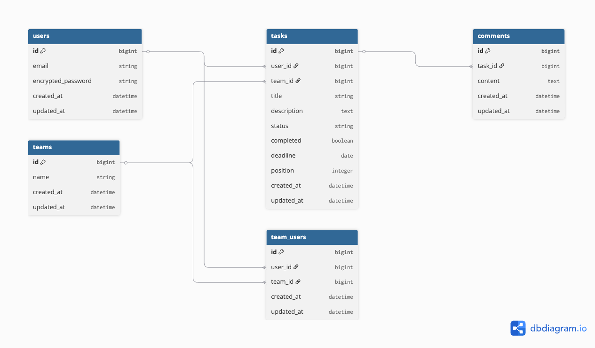

# TaskLink


## URL

### Production (AWS EC2)

https://tasklink-app.com

### Render (Demo)

https://tasklink-1iv9.onrender.com

---

# アプリ概要

TaskLinkは、Turbo Streamを活用したリアルタイム更新対応のToDo管理アプリです。

実務を意識し、

- ドラッグ＆ドロップ
- モーダルUI
- 期限管理
- 達成率表示
- 認証 / 権限制御
- CI/CD

を実装しています。

---

## 📷 画面イメージ

### タスク一覧


### 新規作成


### 検索結果（検索ワード）


### 検索結果（完了）


## 💡 Key Features / 工夫した点

### Turbo Streamによるリアルタイム更新

タスク作成・更新・削除時に、

- タスク一覧
- 達成率バー
- フィルター件数

をページリロードなしで更新。

### UI/UXを意識した設計

- モーダルUI
- ドラッグ＆ドロップ
- 期限状態の色分け
- 視認性を意識したデザイン

### Error Handling

異常系のUXも考慮し、404 / 500 カスタムエラーページを実装しています。

404 Not Found

存在しないURLへアクセスした場合、ユーザーが迷わないようにエラーページを表示し、タスク一覧へ戻れる導線を用意しています。

500 Internal Server Error

サーバ内部エラー発生時にも専用ページを表示し、ユーザー体験を損なわない構成にしています。

- カスタム404ページ
- カスタム500ページ
- タスク一覧へ戻る導線
- 異常系UXを考慮した設計


### 実運用を意識したインフラ構築

AWS EC2上に、

- Nginx
- Puma
- systemd
- PostgreSQL

を構築。

独自ドメイン + HTTPS にも対応。


## Tech Stack

| Category | Tech |
|---|---|
| Backend | Ruby 3.3 / Rails 8 |
| Frontend | Turbo / Stimulus / Tailwind |
| DB | PostgreSQL |
| Infra | AWS EC2 / Nginx / Puma |
| CI/CD | GitHub Actions |


## Docker Development Environment

TaskLinkでは、Docker / Docker Compose に対応し、開発環境をコンテナ化しています。

Rails + PostgreSQL を Docker 上で動作させることで、ローカル環境差異を減らし、再現性の高い開発環境を構築しています。

### 構成

```text
Docker Compose
├─ web (Rails 8 / Puma)
└─ db (PostgreSQL 16)
```

### 使用技術

* Docker
* Docker Compose
* PostgreSQL 16
* Ruby 3.3
* Rails 8

### 起動方法

```bash
# build
docker compose build

# DB create
docker compose run web rails db:create

# migration
docker compose run web rails db:migrate

# start
docker compose up
```

ブラウザ：

```text
http://localhost:3000
```

### 永続化（Volume）

PostgreSQL データは Docker Volume により永続化しています。

そのため、

```bash
docker compose down
```

後もデータは保持されます。

DB を初期化したい場合：

```bash
docker compose down -v
```

### Docker Optimization

`.dockerignore` を設定し、不要ファイル（log / tmp / node_modules / coverage など）を除外することで、Docker build の軽量化と開発環境の再現性向上を行っています。

### Docker採用理由

* 開発環境差異の削減
* 再現性の高い環境構築
* Rails / PostgreSQL の依存関係管理
* 将来的なコンテナベース運用を見据えた構成


## ER Diagram

将来的なチーム共有機能・コメント機能まで見据えて設計しています。




## 作成背景

Rails基礎学習後、

- 「実際に使いたくなるアプリ」
- 「動きで差別化できるポートフォリオ」

を意識して開発しました。

特に、

- Turbo Streamによるリアルタイム更新
- UI/UXへのこだわり
- AWS本番環境構築

に力を入れています。

---


## Infrastructure

```text
GitHub Actions (CI/CD)
        ↓
Browser
   ↓ HTTPS
Nginx (Reverse Proxy)
        ↓
Puma
        ↓
Rails 8 Application
        ↓
PostgreSQL
```


## 構成ポイント

### Nginx

- リバースプロキシとして動作
- HTTP/HTTPSリクエストをPumaへ転送

### Puma

- Railsアプリケーションサーバー
- systemd管理で自動起動

### systemd

- Pumaのプロセス管理
- EC2再起動後も自動復旧

### Elastic IP

- 固定IP化
- 停止・再起動後もURL変更なし

### HTTPS

- Let's Encrypt + CertbotでSSL化
- HTTP → HTTPSへ自動リダイレクト

---


# 主な機能

## タスク管理

- タスク作成
- タスク編集
- タスク削除
- ステータス変更

  - 📝 未着手（todo）
  - 🔥 作業中（doing）
  - ✅ 完了（done）

## 検索・フィルター

- キーワード検索
- ステータス別フィルター
- タスク件数リアルタイム表示

## ドラッグ＆ドロップ

SortableJSを利用し、タスクを直感的に並び替え可能

- 並び替え保存
- ドラッグ中エフェクト
- プレースホルダ表示

## モーダルUI

Turbo Frameを利用し、ページ遷移なしでタスクの作成・編集が可能

- ESCキーで閉じる
- 背景オーバーレイ対応

## 期限管理

- 期限日設定
- 期限切れ表示
- 残り日数表示
- 状況に応じた色分け

### 表示例

- 🔴 期限切れ
- 🟡 今日まで
- 🟢 余裕あり

## 達成率バー

完了タスク割合をリアルタイム可視化

- Turbo Streamによる即時更新
- 進捗率の視覚化

---

## AWS本番環境構築 / CI/CD

AWS EC2上にRailsアプリをデプロイし、

- Nginx
- Puma
- systemd
- PostgreSQL

を利用した本番環境を構築しています。

また、独自ドメイン・HTTPS（SSL/TLS）に対応し、安全な通信環境を実現しています。

さらに GitHub Actions を利用し、CI/CD を構築しています。

### CI（自動品質チェック）

GitHub Actions により、push / pull request 時に以下を自動実行しています。

- RuboCop（コード品質チェック）
- bundler-audit（脆弱性チェック）
- Rails Test

これにより、本番反映前にコード品質・セキュリティ・テストを自動検証しています。

### CD（自動デプロイ）

main ブランチへ push 後、自動で EC2 本番環境へデプロイ。

デプロイ時には以下を自動実行しています。

- `bundle install`
- `rails db:migrate`
- `assets:precompile`
- Puma restart（systemd）

コード変更から本番反映までを自動化し、運用負荷を削減しています。

---

## Test Strategy

品質担保のため、Model / Request / System Test を実装しています。

### Model Test

- validation
- association
- deadline正常系

### Request Test

- CRUD
- 認証
- 他ユーザー制御
- 検索 / フィルター
- progress NaN再発防止

### System Test

- タスク作成
- status変更
- モーダル
- 検索

### Result

35 runs, 73 assertions, 0 failures

Coverage: 90.23%


---

## Future Features

- チーム共有
- 通知機能
- カレンダー表示
- Docker対応
- GitHub Actions強化

---

# セットアップ方法

```bash
# clone
git clone https://github.com/katsu-ya/tasklink.git

# move
cd tasklink

# install
bundle install

# database
rails db:create
rails db:migrate

# start
bin/dev
```


# 作者

新城克哉

GitHub:
https://github.com/katsu-ya

---


